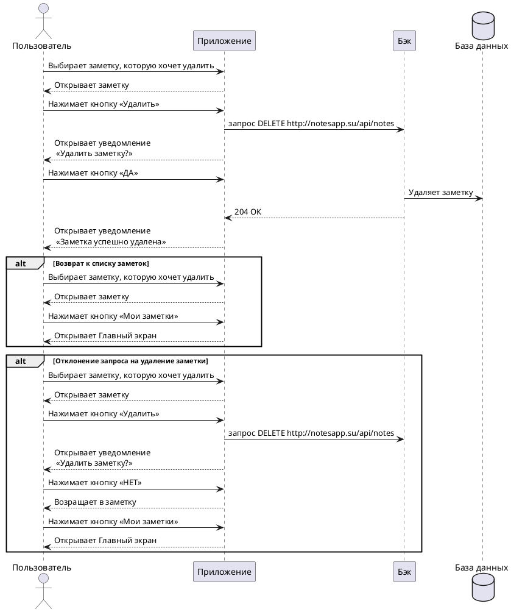

# Диаграмма последовательности

```puml

@startuml
actor Пользователь
participant Приложение
participant Бэк
database "База данных"

Пользователь -> Приложение: Выбирает заметку, которую хочет удалить
Пользователь <-- Приложение: Открывает заметку
Пользователь -> Приложение: Нажимает кнопку «Удалить»
Приложение -> Бэк: запрос DELETE http://notesapp.su/api/notes
Приложение --> Пользователь: Открывает уведомление\n «Удалить заметку?»
Пользователь -> Приложение: Нажимает кнопку «ДА»
Бэк -> "База данных": Удаляет заметку
Бэк --> Приложение: 204 ОК
Приложение --> Пользователь: Открывает уведомление\n «Заметка успешно удалена»

alt Возврат к списку заметок
Пользователь -> Приложение: Выбирает заметку, которую хочет удалить
Пользователь <-- Приложение: Открывает заметку
Пользователь -> Приложение: Нажимает кнопку «Мои заметки»
Приложение --> Пользователь: Открывает Главный экран
end alt

alt Отклонение запроса на удаление заметки
Пользователь -> Приложение: Выбирает заметку, которую хочет удалить
Пользователь <-- Приложение: Открывает заметку
Пользователь -> Приложение: Нажимает кнопку «Удалить»
Приложение -> Бэк: запрос DELETE http://notesapp.su/api/notes
Приложение --> Пользователь: Открывает уведомление\n «Удалить заметку?»
Пользователь -> Приложение: Нажимает кнопку «НЕТ»
Приложение --> Пользователь: Возращает в заметку
Пользователь -> Приложение: Нажимает кнопку «Мои заметки»
Приложение --> Пользователь: Открывает Главный экран
end alt

@enduml
```