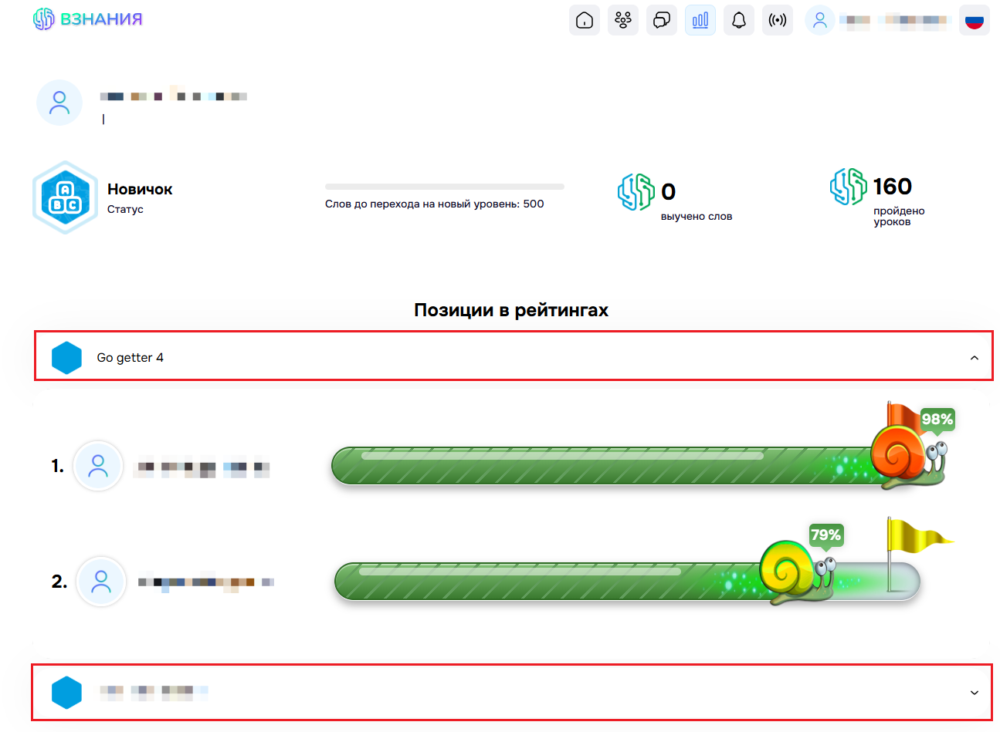

# Статистика выполненных заданий

В данном разделе отображается ваш текущий статус в изучении новых слов. Вы можете увидеть сколько слов осталось до перехода на следующий уровень, а также сколько слов и уроков успешно пройдено.
Статистику можно смотреть как по одному ученику, так и по группе вцелом.
Чтобы отобразить информацию, откройте папку с назвнием группы или ФИО ученика.

