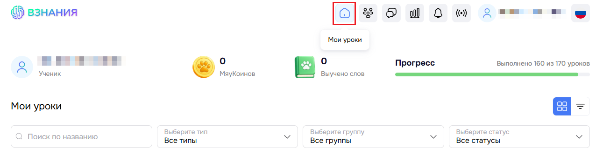
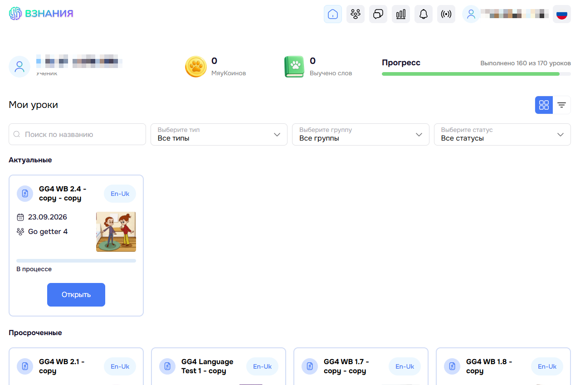

# Выполнение заданий

Для выполения задания перейдите в раздел **Мои уроки**.

Отобразится страница раздела **Мои уроки**.

В подразделе **Актуальные** находятся уроки, которые требуется выполнить.

В подразделе **Просроченные** находятся уроки, срок выполнения которых закончился. Такие уроки также можно выполнить.

В подразделе **Выполненные** находятся уже выполненные уроки.

Чтобы перейти в урок, нажмите кнопку **Открыть**. Вы увидите задания, которые нужно выполнить.
Предодаватель может назначить разные типы уроков.

Вы также можете переключиться на другой режим отображения уроков для удобства. Один из таких режимо называется отображение **Списком**. В этом режиме группы будут выглядеть как папки. Открыв папку вы увидите, что выполненные уроки направляются вниз и отмечены галочкой.

Актуальные уроки отображаются вверху и сопровождаются сроком сдачи.

После выполнения всех заданий нажмите кнопку **Завершить**. 

