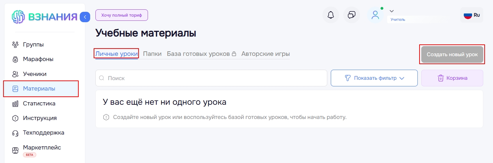

# Интерактивный урок

Интерактивный урок является интеракивным рабочим листом, который идеально подойдет в качестве домашнего задания и не только.
Вы можете создавать интрактивные уроки, используя шаблоны, игры, тексты и видео.
Для создания урока перейдите в раздел **Материалы**, на вкладку **Личные уроки" и нажмите на кнопку **Создать новый урок**.

Отобразится главная страница создания урока. Для выхода из главной страницы создания урока нажмите иконку «Крестик».
Далее введите название урока. Заполнение данного поля является обязательным, без него урок не сохранится.
По желанию можно добавить к уроку изображение, нажав на значок «Картинки». Данное изображение будет отображаться в списке уроков в кабинете учителя.
Также по желанию вы можете заполнить поле «Комментарий».
При создании урока вы можете выбрать тип задания либо загрузить задание из готовых уроков.

Все уроки, которые вы не сохранили автоматически попадают в черновики. Для просмотра таких уроков нажмите на кнопку **Черновики**. Xерновики хранятся 7 дней. По кнопке «Применить» вы можете продолжить работу с черновиком. Чтобы удалить черновик нажмите на «Корзину». В этом случае черновик удалится навсегда.
Для создания урока в папке перейдите на вкладку **Папки**.
